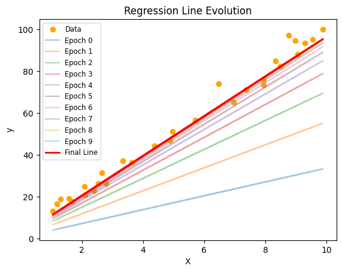
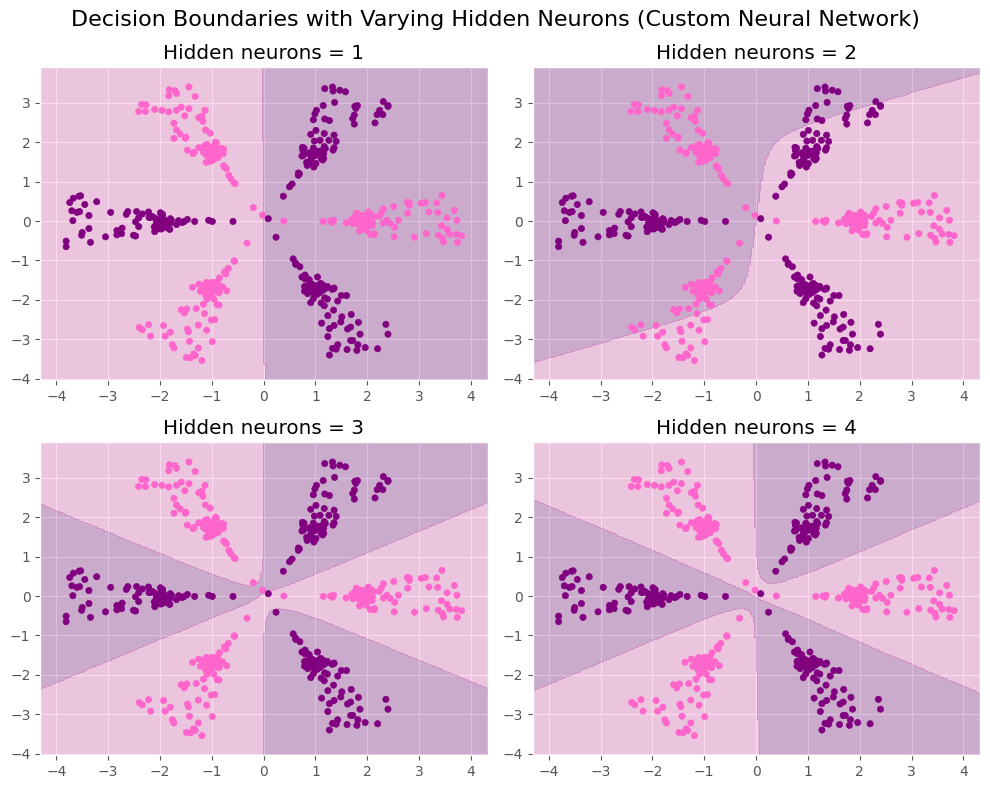

# ML Models From Scratch

- This repository demonstrates **machine learning models implemented from scratch** using Python and NumPy. 
- It covers **Linear Regression** and **Neural Networks**.


## Folder Structure

```
ML-MODELS-FROM-SCRATCH/
│
├─ datasets/
│ ├─ linear-data.csv # Dataset for Linear Regression
│ ├─ neural-data.csv # Dataset for Neural Network
│ └─ dataset-code-neural.ipynb
│
├─ linear-regression.ipynb # Linear Regression from scratch
├─ neural-network.ipynb # Neural Network from scratch
├─ .gitignore
└─ README.md
```

## Models Included

## *1️⃣ Linear Regression*
- Implemented **gradient descent** manually.
- Visualizes training/test splits.
- Tracks cost evolution over epochs.
- Plots regression line evolution and predictions.
- Evaluates model with **MAE, MSE, and R² score**.

#### Example Output



### *2️⃣ Neural Network*
- Implements a **2-layer feedforward neural network**
- Input → Hidden (tanh) → Output (sigmoid)
- Forward and backward propagation implemented manually.
- Loss tracked over epochs.
- Decision boundary visualization.
- Experiments with **varying number of hidden neurons**.

#### Example Output
